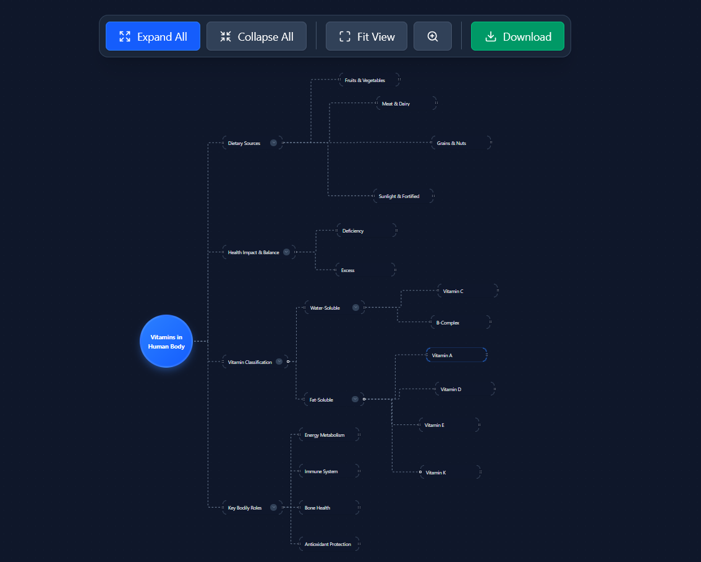
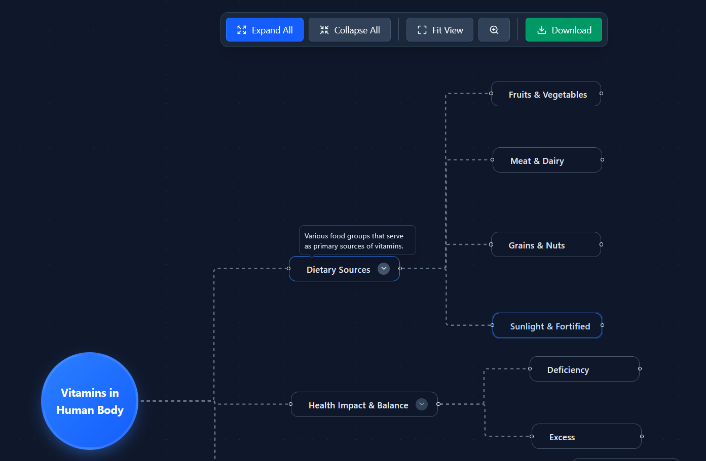
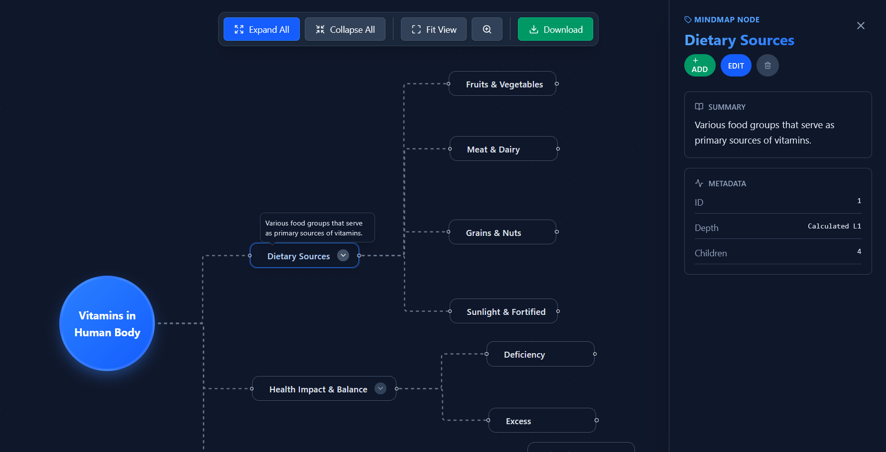
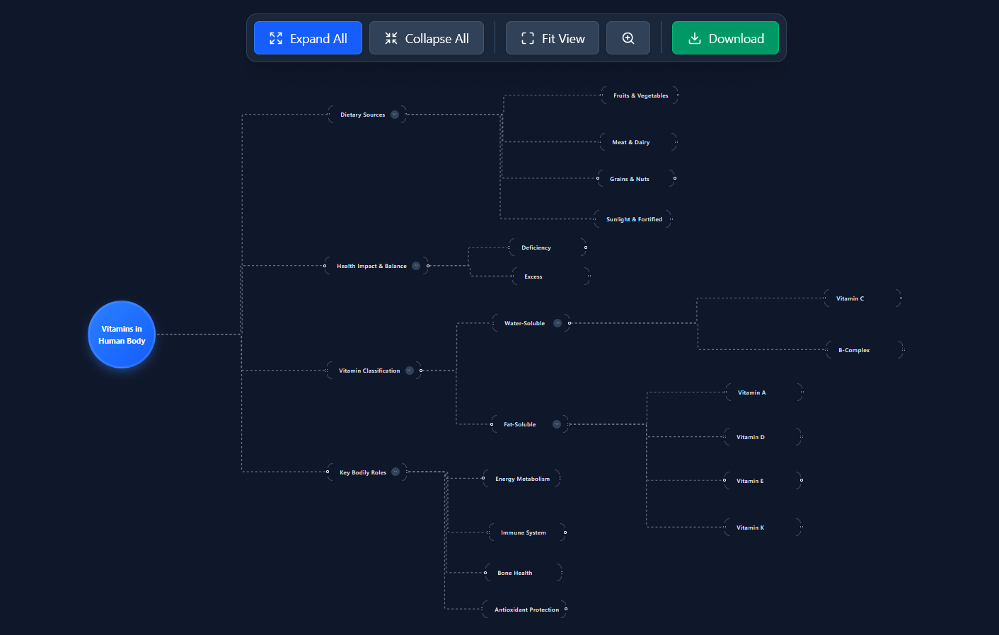
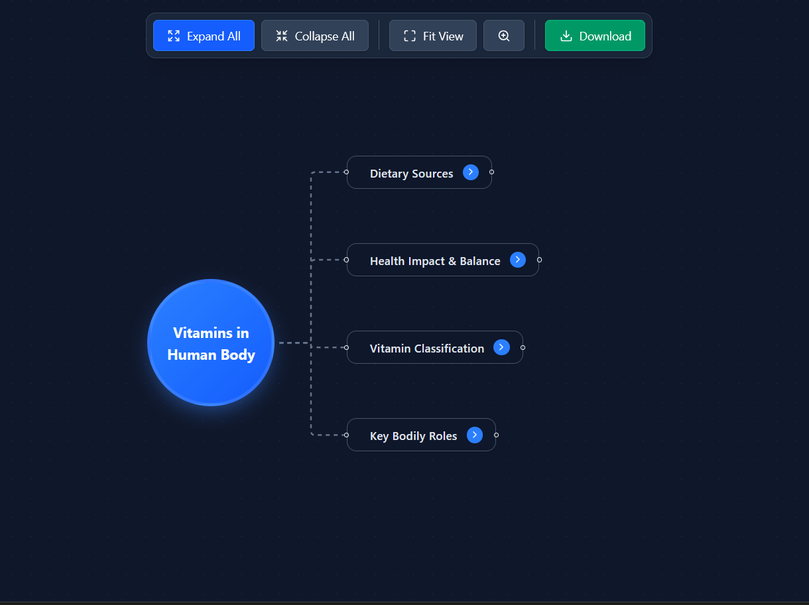

# React Mindmap UI Solution Description

## 1. Technologies Used
- **Frontend Framework:** React 19
- **Build Tool:** Vite
- **Styling:** Tailwind CSS (v4 via `@tailwindcss/vite`)
- **Language:** JavaScript (ES6+)

## 2. Libraries Used & Rationale

### **React Flow (`reactflow`)**
*   **Why:** It is the industry-standard library for building node-based applications in React. It handles the complex logic of zooming, panning, dragging, and rendering nodes/edges efficiently, allowing us to focus on the custom node design and business logic.

### **Dagre (`dagre`)**
*   **Why:** React Flow does not provide auto-layout out of the box. Dagre is a graph layout engine that calculates optimal node positions for hierarchical structures (like mindmaps). We use it to automatically arrange nodes in a clean Left-to-Right (LR) tree structure.

### **Lucide React (`lucide-react`)**
*   **Why:** A consistent, lightweight, and modern icon set. It is used for UI elements like buttons (Zoom, Fit View), node indicators (Chevron for collapse/expand), and sidebar icons.

### **HTML-to-Image (`html-to-image`)**
*   **Why:** To implement the "Download Mindmap" feature. It captures the DOM element of the mindmap viewport and converts it into a high-quality PNG image for the user.

## 3. Overall Architecture / Approach

The application is built using a **Data-Driven Architecture**. The core philosophy is that the Single Source of Truth is a hierarchical data structure (Tree), which is then transformed into the flat format required by the rendering library.

### **Key Components:**
1.  **`App.jsx`**: The entry point. It sets up the `ReactFlowProvider` and renders the main layout (`MindMapFlow` and `Sidebar`).
2.  **`useMindmap.js` (Custom Hook)**: The brain of the application. It encapsulates all state management:
    *   Maintains the hierarchical `treeData`.
    *   Manages `collapsedIds` (which nodes are closed).
    *   Handles selection, addition, deletion, and updates of nodes.
    *   Triggered side-effects to re-calculate layout whenever data changes.
3.  **`Nodes.jsx`**: Contains custom React Flow node components (`RootNode` and `MindMapNode`). These components are purely presentational but include interactive elements (like the expand/collapse toggle).
4.  **`Sidebar.jsx`**: A collapsible side panel that displays details for the selected node and provides a UI for editing labels/summaries, adding children, or deleting nodes.
5.  **`layout.js`**: A utility module containing the `getLayoutedElements` function (Dagre integration) and `flattenTree` (recursive data transformation).

## 4. Data Flow

1.  **Initialization**:
    *   The app loads raw hierarchical data from `src/data.json`.
    *   This data is passed to the `useMindmap` hook.

2.  **Transformation (Tree -> Graph)**:
    *   Inside `useMindmap`, a `useEffect` listens for changes to `treeData` or `collapsedIds`.
    *   It calls `flattenTree`, which recursively traverses the JSON tree.
    *   It skips children of nodes that are in the `collapsedIds` set.
    *   It generates a flat array of `nodes` and `edges`.

3.  **Layout Calculation**:
    *   The flat nodes/edges are passed to `getLayoutedElements`.
    *   Dagre calculates `x` and `y` coordinates for every node based on the graph topology.
    *   The positioned elements are set into the `reactflow` state.

4.  **Rendering**:
    *   React Flow renders the nodes using the Custom Node definitions in `Nodes.jsx`.

5.  **User Interaction**:
    *   **Expand/Collapse**: Clicking a toggle updates `collapsedIds` -> Re-triggers transformation -> Re-renders graph.
    *   **Edit/Add/Delete**: Interaction in the `Sidebar` calls methods exported by `useMindmap` (`updateNodeData`, `addNode`, `deleteNode`).
    *   These methods immutably update the `treeData` state.
    *   The cycle repeats from step 2 (Transformation), ensuring the UI always stays in sync with the underlying data model.

## 5. Screenshots

### Full View

### Hover Interaction

### Node Selection (Sidebar)

### Expanded vs Collapsed
**Expanded State:**

**Collapsed State:**

